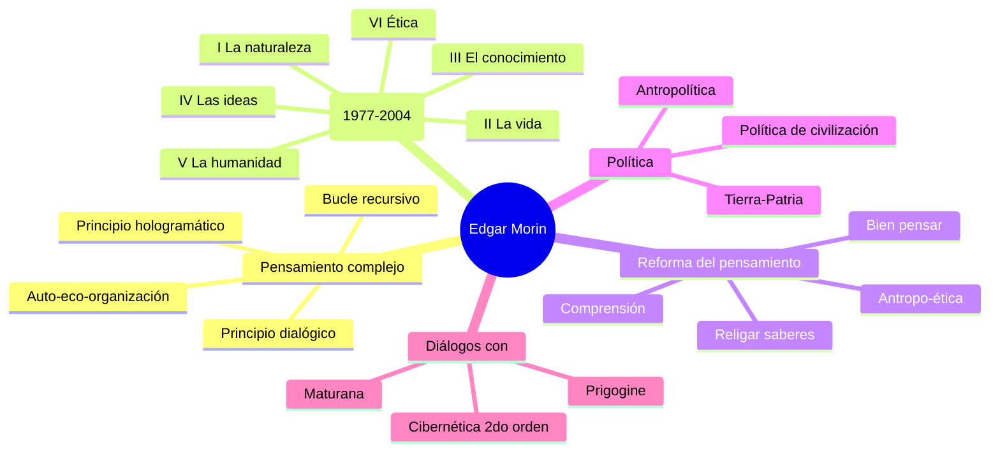
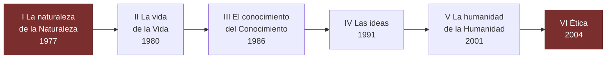

# Edgar Morin

> Sociólogo y filósofo francés, arquitecto del **pensamiento complejo** y autor de la obra mayor *El Método* (6 volúmenes).

## Contexto

Nacido en París en 1921, Morin atraviesa el siglo XX como testigo y teórico: Resistencia, antropología, sociología, filosofía de la ciencia. Su programa busca **religar los saberes** que la modernidad fragmentó, sin caer en un holismo ingenuo. *El Método* es un esfuerzo de medio siglo por formular una epistemología capaz de pensar lo viviente, lo humano y la sociedad **sin reducir y sin disolver**.

## Obras en este vault

- [[El Método I - La naturaleza de la Naturaleza]]

## Conceptos que introduce o desarrolla

- [[Complejidad]]
- [[Principio dialógico]]
- [[Principio hologramático]]
- [[Bucle recursivo]]

## Diálogos con

- [[Humberto Maturana]] — coincide en la **autoorganización** de lo vivo, aunque desde una vía menos biologicista.
- [[Ilya Prigogine]] — Morin recoge la noción de **estructura disipativa** para fundamentar su física de la complejidad.
- [[Francisco Varela]] — comparten la crítica al cognitivismo representacionalista.

## Citas representativas

> "La complejidad es una palabra-problema y no una palabra-solución."  
> — *Introducción al pensamiento complejo*

> "Conocer y pensar no es llegar a una verdad absolutamente cierta, es dialogar con la incertidumbre."  
> — *El Método*

## Mapa mental del corpus

## Los 6 volúmenes de El Método

