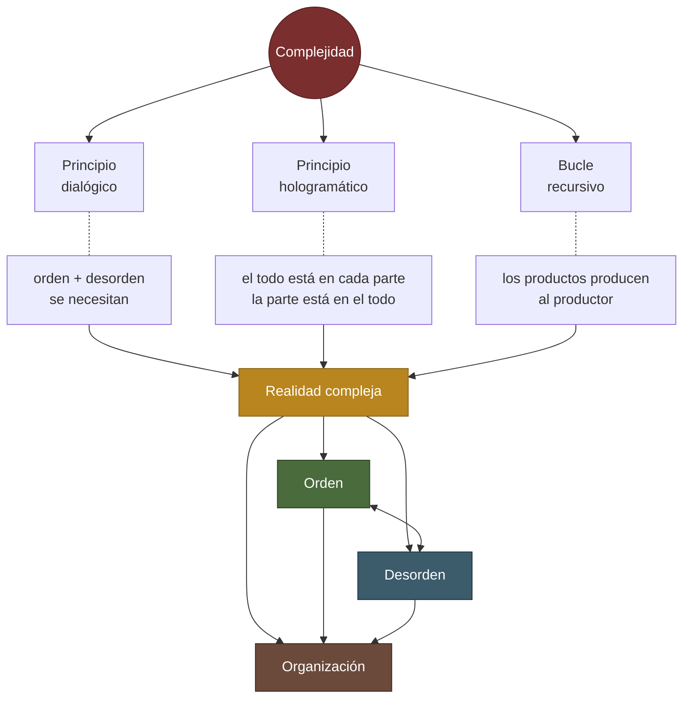

# Complejidad

> Entretejimiento de orden, desorden e interacciones que impide reducir un fenómeno a sus partes.

## Origen

- Autor: [[Edgar Morin]]
- Obra: [[El Método I — La naturaleza de la Naturaleza]]
- Fuente: Vol. 1 — La naturaleza de la Naturaleza

## Explicación

Morin distingue entre *complicado* (intrincado pero descomponible) y *complejo* (irreduciblemente entrelazado). Un sistema complejo no es la suma de sus elementos; emerge de sus relaciones. Cuando los átomos se organizan en moléculas, en células, en organismos, surgen propiedades que ningún átomo posee aisladamente—eso es complejidad.

La complejidad surge de tres aspectos: la *multiplicidad* de elementos, la *interdependencia* entre ellos, y la *creatividad emergente*. En una ciudad, millones de acciones individuales interactúan de manera impredecible; en un cerebro, cien mil millones de neuronas generan conciencia. Este patrón aparece en la naturaleza, la vida y la sociedad.

Aceptar la complejidad significa renunciar al sueño de certeza absoluta. Pero también abre posibilidades de comprensión más profunda y acción más responsable.

## Cita fundadora

> ¿No es la forma irracionalizable de una complejidad que está fuera del alcance de nuestro entendimiento?

## Conceptos relacionados

- [[Pensamiento complejo]]
- [[Sistema abierto]]
- [[Emergencia]]
- [[Orden / Desorden]]
- [[Paradigma de simplificación]]

## Cómo se compone la complejidad

> No es resultado: es **proceso**. Orden, desorden y organización se producen mutuamente sin sintetizarse en una unidad superior.
