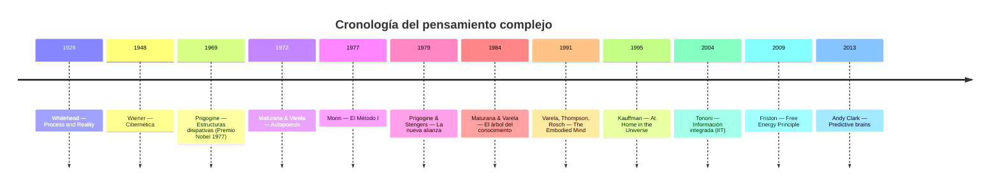
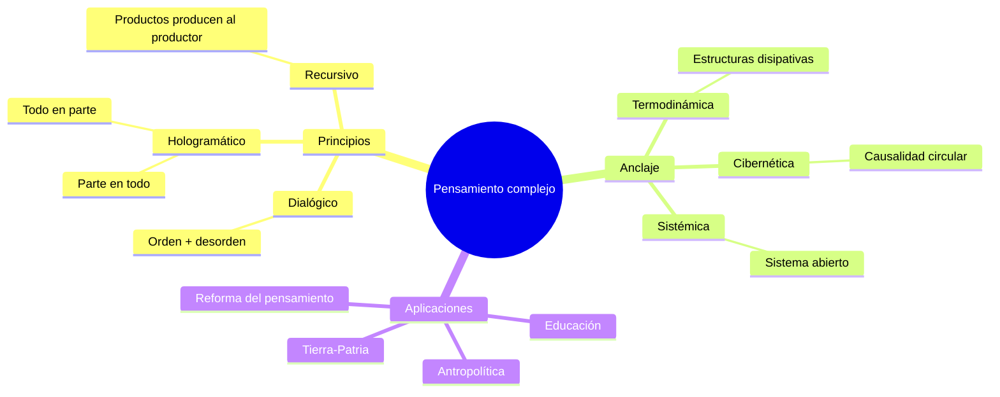
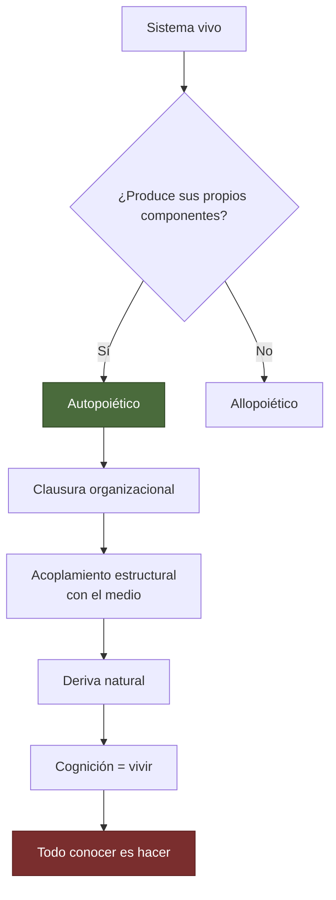
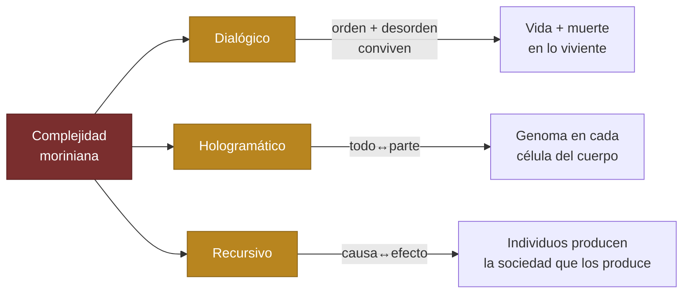
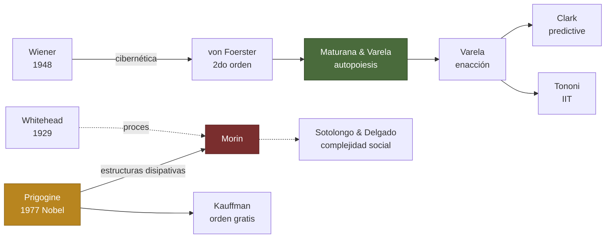
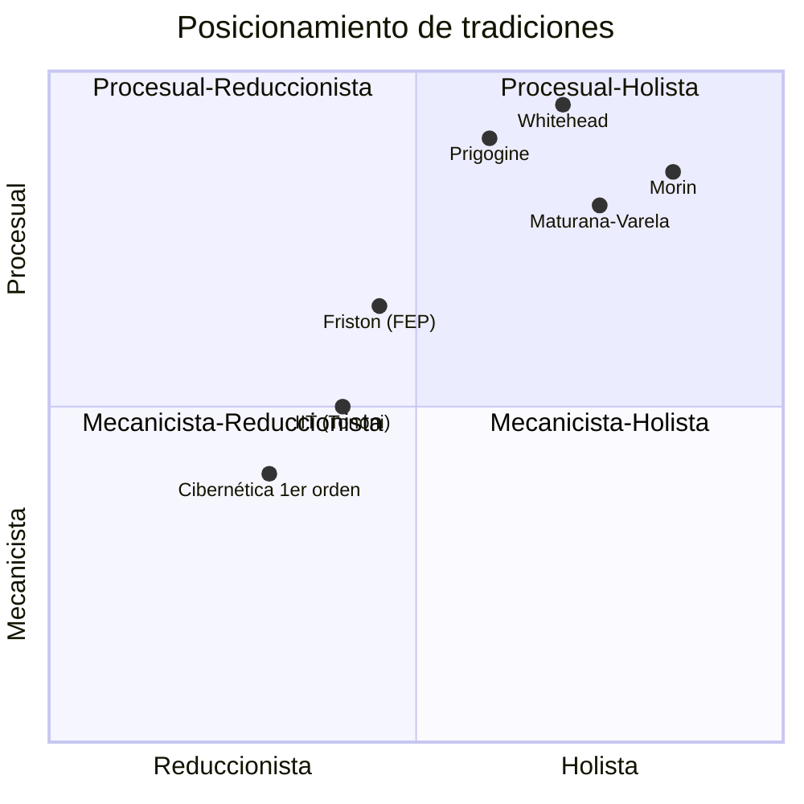
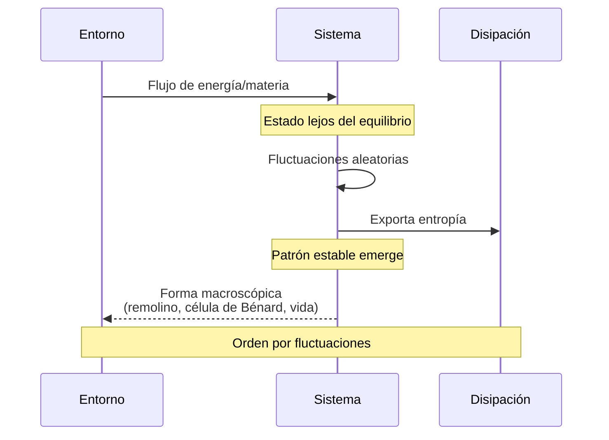
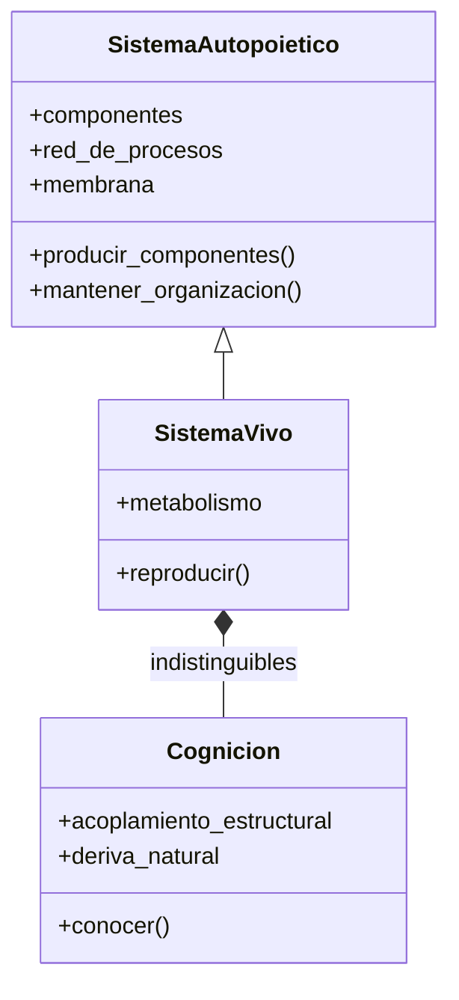
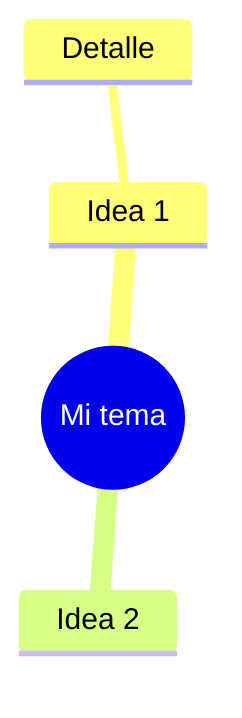

# 🌐 Visualizaciones Mermaid

> Catálogo de diagramas embebidos directamente en notas. Mermaid se renderiza nativamente en Obsidian sin plugins. Todo lo de aquí lo puedes copiar y pegar a tus propias notas.

## ¿Cuándo usar Mermaid?

- Cuando quieres una **visualización inline** que viaje con la nota.
- Para diagramas **versionables** en git (es texto plano, no binario).
- Cuando quieres que se rendericen en **Quartz** publicado, en **GitHub**, en cualquier viewer Markdown — sin instalar nada.

## ¿Cuándo NO usar Mermaid?

- Si necesitas dibujo libre con curvas o texto manuscrito → **Excalidraw**.
- Si necesitas layout espacial flexible para un taller → **Canvas**.
- Si necesitas grafo dinámico de cientos de nodos → **Graph view + plugins**.

---

## 1. Timeline — Cronología del pensamiento complejo



---

## 2. Mindmap — Pensamiento complejo (Morin)



---

## 3. Flowchart — Lógica de la autopoiesis



---

## 4. Flowchart — Los tres principios de la complejidad



---

## 5. Graph — Linaje intelectual (qué autor influye en quién)



---

## 6. Quadrant — Posicionamiento epistemológico



---

## 7. Sequence — Cómo emerge una estructura disipativa



---

## 8. Class — Estructura conceptual de un sistema autopoiético



---

## Cómo embedear en tus propias notas

Cualquier nota markdown:

````markdown

````

## Recursos

- Sintaxis completa: <https://mermaid.js.org/intro/>
- Editor en vivo: <https://mermaid.live/>
