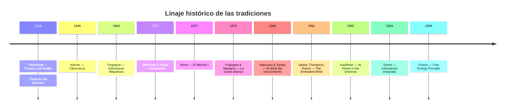
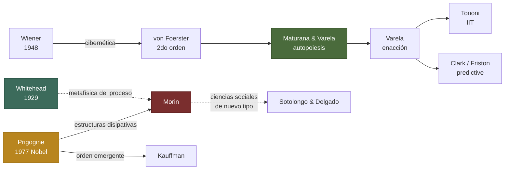

# 🧭 Mapa de tradiciones

Tres tradiciones intelectuales conviven en este vault. Comparten preguntas — *¿cómo emerge el orden?, ¿qué es lo vivo?, ¿qué significa conocer?* — pero las responden desde lenguajes distintos.

## Cronología

## Genealogía intelectual

---

## 1. Pensamiento complejo (Francia)

> Tradición epistemológica que articula órdenes y desórdenes en una **paradigmatología** general.

- **Autor:** [[Edgar Morin]]
- **Obra clave:** [[El Método I - La naturaleza de la Naturaleza]]
- **Conceptos:** [[Complejidad]], [[Principio dialógico]], [[Principio hologramático]], [[Bucle recursivo]]

## 2. Autopoiesis y enactivismo (Chile)

> Biología teórica radical: lo vivo se define por su **clausura organizacional**, y el conocer es indistinguible del vivir.

- **Autores:** [[Humberto Maturana]], [[Francisco Varela]]
- **Obra clave:** [[El árbol del conocimiento]]
- **Conceptos:** [[Autopoiesis]], [[Deriva natural]]

## 3. Termodinámica del no-equilibrio (Bélgica → mundo)

> Física del **orden emergente**: la flecha del tiempo deja de ser pura degradación para convertirse en fuente de novedad.

- **Autor:** [[Ilya Prigogine]]
- **Obras clave:** [[La nueva alianza]], [[At Home in the Universe]] *(Kauffman, vecindad temática)*
- **Conceptos:** [[Estructura disipativa]], [[Autoorganización]]

---

## Puentes conceptuales

Aquí es donde Obsidian brilla — el grafo te muestra estos cruces sin que tengas que listarlos:

- [[Autoorganización]] es el puente principal: aparece en las tres tradiciones bajo lenguajes distintos.
- [[Estructura disipativa]] (Prigogine) **funda físicamente** la posibilidad de la [[Autopoiesis]] (Maturana–Varela) y se integra como pieza clave en la [[Complejidad]] (Morin).
- El [[Bucle recursivo]] de Morin es la versión epistemológica de la clausura autopoiética.

> Abre el grafo (Ctrl+G) y filtra por la etiqueta `#tipo/concepto` para ver las conexiones.
